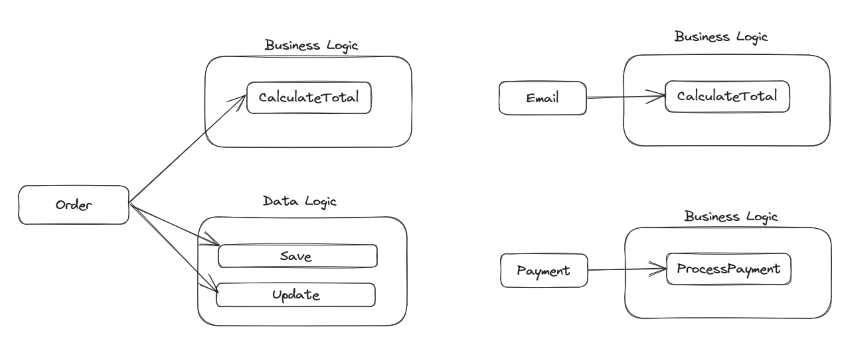
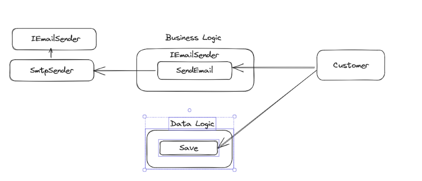

SOLID are five design principles used to make your software design more understandable, flexible, and maintainable. They could be used in any OOP language. - [Wikipedia](https://en.wikipedia.org/wiki/SOLID)

1. Single Responsibility Principle (SRP): A class should have only one responsibility, and there should be only a single reason to change it.

2. Open-Closed Principle (OCP): A class should be open for extension, but closed for modification.

3. Liskov Substitution Principle (LSP): Derived classes should be substitutable for their base classes.

4. Interface Segregation Principle (ISP): Clients should not be forced to depend on interfaces that they do not use.

5. Dependency Inversion Principle (DIP): A class should depend upon abstraction (interface and abstract class), not concretions.

___________________________________________________________________________________________________________________________________________

S - Single Responsibility Principle:

Problem: Order class has too many responsabilities. Calculate total, process payment, send e-mail, and data logic to save/update.


```
class Order{
   decimal CalculateTotal(){...}
   void ProcessPayment(decimal amount){...}
   void SendEmail(string email){...}
   void Save(Order order){...}
   void Update(Order order){...}
}
__
Order: 1 - Status: Pending
Order: 1 - ProcessPayment: 121.14  
Order: 1 - Status: PaymentReceived 
Order: 1 - SendEmail: bia@solid.com
```

Solution: Split business logic into multiple classes and implement their specific responsabilities.



```
class Order{
   decimal CalculateTotal(){...}	
   void Save(Order order){...}
   void Update(Order order){...}
}
class Payment{
   bool ProcessPayment(decimal amount){...}
}
class Email{
   void SendEmail(int orderId, string email){...}
}
__
Order: 2 - Status: Pending
Payment: Process 121.14
Order: 2 - Status: PaymentReceived
Email: SendEmail 2 - ed@solid.com 
```

O - Open Closed Principle:

Problem: CalculateTotal is based into PaymentType. In the future, the code needs to be modified to be based into another PaymentType.


```
class Order{
   PaymentType _paymentType {...}
   decimal CalculateTotal(){...}	
   void Save(Order order){...}
   void Update(Order order){...}
}
class Payment{
   bool ProcessPayment(decimal amount){...}
}
enum PaymentType{
   Cash,
   Card   
}
__
Customer: Ed - Order: 2 - Status: Pending
Payment: Cash - CalculateTotal()
Payment: Process 121.14
Customer: Ed - Order: 2 - Status: PaymentReceived - Total: 121.14
``` 
Solution: Create a new interface IPayment and create two new classes CardPayment and CashPayment, both of which implement the IPayment interface.


```
class Order{
   PaymentType _paymentType {...}
   decimal CalculateTotal(){...}	
   void Save(Order order){...}
   void Update(Order order){...}
}
interface IPayment {
   decimal CalculateTotal(decimal amount);
}
class CardPayment: IPayment {
   decimal CalculateTotal(decimal amount) {...};
   bool ProcessPayment(decimal amount){...}
}
class CashPayment: IPayment {
   decimal CalculateTotal(decimal amount){...};
   bool ProcessPayment(decimal amount){...}
}
enum PaymentType{
   Cash,
   Card   
}
__
Customer: Bia - Order: 1 - Status: Pending
Payment: Process 121.14
Customer: Bia - Order: 1 - Status: PaymentReceived - Total: 121.14
Customer: Ed - Order: 2 - Status: Pending
Payment: Process 121.14
Customer: Ed - Order: 2 - Status: Pending - Total: 181.710  

```

L - Liskov Substitution Principle:

Problem: ToyTruck extends Truck but does not support Refuel() method.


```
class Truck{
   virtual void Start(){...}
   virtual void Run() {...}
   virtual void Stop() {...}
   virtual void Refuel(int amount) {...}
}
class ToyTruck : Truck{
   override void Start(){...}
   override void Run(){...}
   override void Stop() {...}
   override void Refuel(int amount) {...} //throw new InvalidOperationException("ToyTruck does not need to refuel");
}
__
Truck needs to refuel
Truck is running: 1     
ToyTruck needs to refuel
Unhandled exception. System.InvalidOperationException: ToyTruck does not need to refuel
   at LiskovSubstitutionProblem.ToyTruck.Refuel(Int32 amount) in D:\GitHub\csharp-solid\SOLID\LiskovSubstitutionProblem\ToyTruck.cs:line 33
   at LiskovSubstitutionProblem.Program.Main(String[] args) in D:\GitHub\csharp-solid\SOLID\LiskovSubstitutionProblem\Program.cs:line 14   
```

Solution: Create a new class ToyTruck, so EletronicToyTruck can extends ToyTruck. 


```
class Truck{
   virtual void Start(){...}
   virtual void Run() {...}
   virtual void Stop() {...}
   virtual void Refuel(int amount) {...}
}
class ToyTruck 
   virtual void Start() {...}
   virtual void Stop() {...}
   virtual void Run() {...}  
}
class EletronicToyTruck : ToyTruck{
   override void Start() {...}
   override void Stop() {...}
   override void Run() {...}
}
__
Truck started: Gasoline
Truck needs to refuel       
Truck is running: 1
Truck stopped
EletronicToyTruck started   
EletronicToyTruck is running
EletronicToyTruck stopped  
```

I - Interface Segregation Principle:

Problem: ITransaction interface contains method that force Product to have a dummy implementation.


```
interface ITransaction{
    void Validate();
    void Save();
    void SendEmail();
}
class Supplier : ITransaction
{
   void Validate(){...}
   void Save(){...}
   void SendEmail(){...}
}
class Product : ITransaction{
   void Validate() {...}
   void Save() {...}
   void SendEmail() => throw new NotSupportedException("Product does not send e-mail");
}
__
Supplier: Validate
Supplier: Save
Supplier: SendEmail
Product: Validate
Product: Save
Unhandled exception. System.NotSupportedException: Product does not send e-mail
   at InterfaceSegregationProblem.Product.SendEmail() in D:\GitHub\csharp-solid\SOLID\InterfaceSegregationProblem\Product.cs:line 17
   at InterfaceSegregationProblem.Program.Main(String[] args) in D:\GitHub\csharp-solid\SOLID\InterfaceSegregationProblem\Program.cs:line 15
```

Solution: Implement the SendEmail method into a new interface to solve the issue.


```
interface ITransaction{
    void Validate();
    void Save();    
}
interface ISendEmail{
   void SendEmail();
}
class Product : ITransaction{
   void Validate() {...}
   void Save() {...}   
}
class Supplier : ITransaction, ISendEmail
{
   void Validate(){...}
   void Save(){...}
   void SendEmail(){...}
}
__
Supplier: Validate
Supplier: Save     
Supplier: SendEmail
Product: Validate  
Product: Save   
```

D - Dependency Inversion Principle:

Problem: Customer class directly references EmailSender.


```
class EmailSender{
   void Send(string emailAddress, string subject, string message){...}
}
class Customer{
   Customer(EmailSender emailSender){...}
   void Save() {...}
   void SendEmail(){...}
}
__
Customer: Save
EmailSender: E-mail sent: bia@solid.com - Customer - Test
```

Solution: Create a Interface IEmailSender and SmtpSender and Implement it. Make Customer class directly references IEmailSender.



```
interface IEmailSender{
   void Send(string emailAddress, string subject, string message);
}
class SmtpSender : IEmailSender{
   void Send(string emailAddress, string subject, string message){...}
}
class Customer{
   Customer(IEmailSender emailSender){...}
   void Save() {...}
   void SendEmail(){...}
}
Customer saved
EmailSender: E-mail sent: bia@solid.com - Customer - Test
EmailSender: E-mail sent: ed@solid.com - Customer - Test
```
